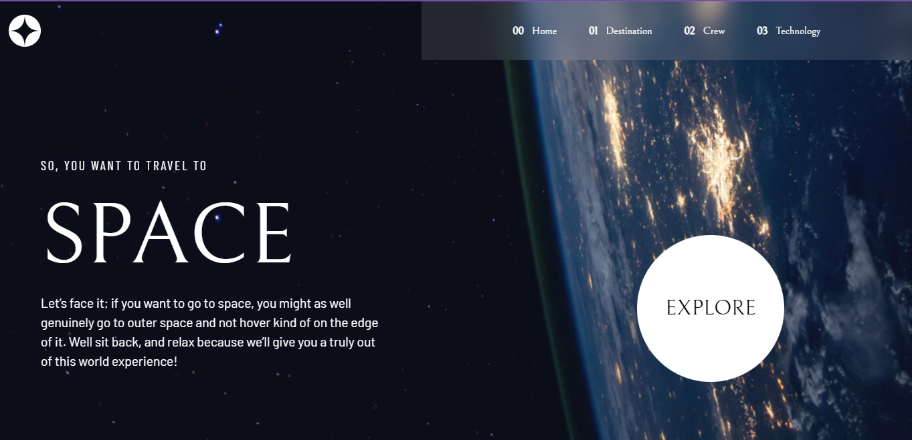

# Frontend Mentor - Space tourism website solution

This is a solution to the [Space tourism website challenge on Frontend Mentor](https://www.frontendmentor.io/challenges/space-tourism-multipage-website-gRWj1URZ3). Frontend Mentor challenges help you improve your coding skills by building realistic projects.

## Table of contents

- [Overview](#overview)
  - [The challenge](#the-challenge)
  - [Screenshot](#screenshot)
  - [Links](#links)
- [My process](#my-process)
  - [Built with](#built-with)
  - [What I learned](#what-i-learned)
  - [Continued development](#continued-development)
  - [Useful resources](#useful-resources)
- [Author](#author)
- [Acknowledgments](#acknowledgments)

## Overview

### The challenge

Users should be able to:

- View the optimal layout for each of the website's pages depending on their device's screen size
- See hover states for all interactive elements on the page
- View each page and be able to toggle between the tabs to see new information

### Screenshot



### Links

- Live Site URL: [Space Tourism Website](https://willowy-choux-ac38f7.netlify.app/)

## My process

### Built with

- Semantic HTML5 markup
- CSS custom properties
- Flexbox
- Bootstrap
- Mobile-first workflow
- Vanilla Javascript

### What I learned

I took up this challenge to practice my javascript skills and learn more, i learnt how to fetch data from a json folder and manipulate said data to be displayed on various pages.

I also learnt to loop through an array using the map() array method, and also used the eventlistener in my script and not my html as i usually did.

The code below is what i've learnt in code, haha.

```
fetch('../js/json/data.json')
  .then((Response) => {
    return Response.json();
  })

  .then((data) => {
    const { crew } = data;

    arrofData = [role, bio, dp, userName];

    arrofImg.forEach((member, index) => {
      member.addEventListener('click', (e) => {
        userName.innerHTML = crew[index].name.toUpperCase();
        bio.innerHTML = crew[index].bio;
        role.innerHTML = crew[index].role.toUpperCase();
        dp.src = crew[index].images.png;
        e.preventDefault();
      });
    });
  });

```

### Continued development

I look forward to working more with Javascript and be able to implement and solve more problems with it

### Useful resources

- GOOGLE has helped me alot, through the different parts of this project

## Author

- LinkedIn - [Olatunbosun Ola](https://www.linkedin.com/in/olatunbosun-olaosebikan-331a291ab/)
- Frontend Mentor - [@7malikk](https://www.frontendmentor.io/profile/7malikk)

## Acknowledgments

Many thanks to my friend Micheal Nwogu, he was of great help during this project.
Alongside the dev accountability group i belong to, they helped in easy they do not know.
Also i also want to thank another friend of mine, Asah Victor for always pushing me in his own way unknowingly.
